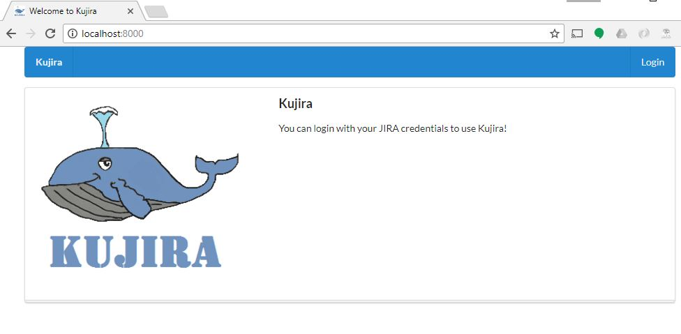

---
---

# Kujira.js 


This is a project to query JIRA via cli and return json, csv or tsv data as a result of the search. 

The project has a web interface that can also query JIRA and return data graphs and reports.

## Demo Video GUI

[](https://youtu.be/oGjQbwPOAoo)

## Demo CLI

[](https://youtu.be/JcZo6eYeboQ)

## Pre-requisites 

To get started you'll need to have the following requirements installed

- Git
- Node.js 6.0.0 or greater<sup>1</sup>
- npm

<sup>1</sup>See https://nodejs.org/

## Dependencies 

- npm install -g jira-miner <sup>2</sup>

    
<sup>2</sup> See https://www.npmjs.com/package/jira-miner


## Getting started
    
    git clone <this repo>
    cd into the new directory
	npm install

## Starting the Web GUI

    node app
    
Returns    
    
    http://localhost:8000   
     
Which takes you to the Welcome screen.

[](https://postimg.org/image/buywusppv/)

## CLI Commands
     
Node setup login into Jira and download a local copy of the project

    node setup
    
Node kujira allows you to build searches against the downloaded project
    
    node kujira
   
Initial setup run 
```bash
$ node setup
Enter username, password and url e.g. "issues.jboss.org"
-->:Enter your Jira Username: enterUserName
-->:Enter your Jira password: *********    
-->:Enter Jira URL e.g. "issues.jboss.org": issues.jboss.org
Command-line input received:
 username: enterUserName
 password: ********
 url: https://issues.jboss.org
stdout: { url: 'https://issues.jboss.org', user: 'enterUserName' } 'Successfu
lly targeted JIRA'
   
-->:Enter the project name e.g. "RHMAP or RAINCATCH": RAINCATCH
 project: RAINCATCH
````

Stand alone query run 
```bash
$ node kujira
Enter format either json or csv ,enter for default tsv : json
Enter the field you wish to search for : Assignee
Enter the value you wish to search for : "Austin Cunningham"
Enter "y" quit or enter to continue :

```

## Running tests
You need Jira credendials to run the tests. You need to update

    /kujira/test/fixtures.json.validUser 
 
with valid credentials before running tests.

````$xslt
"validUser":{
    "username": "InsertValidUsername",
    "password": "InsertValidPassword",
    "url": "issues.jboss.org"
  },
````

Run tests

    `npm test`

## API documentation

See [API.md](API.md) for details.
